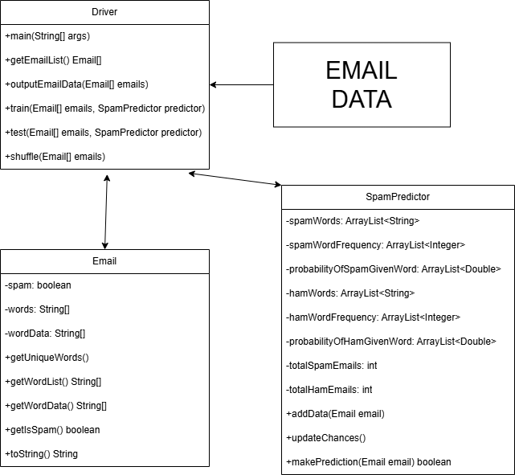

# CSC240 Final Project
By Matthew Yeager  & Aidan Neff

## Project Description
This program works as an Email Spam detector using a Naive Bayes Algorithm. This is only a simple application, with many more complex versions available.

In simple, each Email can only be one of two values, spam or ham. To find the probability that each email is spam or ham, we find the individual chance that each word is spam or ham.

We find this using the proportion of spam emails that contain such word, and proportion of ham emails that use said word. Combining this with the overall chance that an email is spam or ham we can find a "spam probability" for each word.

Using each word in an email, we can combine these probabilities and find the overall probability that an entire email is spam. Finally, we use a similar process to find the ham probability and compare directly, giving us a final prediction for the email.

[Click here for more information on the mathematics behind this algorithm](https://digitalcommons.morris.umn.edu/horizons/vol2/iss1/2/)

This program takes in email data from a [csv file](https://github.com/MatthewYeagerWCU/CSC240FinalProject/blob/main/Data/spam_or_not_spam.csv), and outputs some basic email data to a separate [csv file](https://github.com/MatthewYeagerWCU/CSC240FinalProject/blob/main/Data/email_data.csv).

## UML

(UML Diagram of Program)

This program has 4 main points of interest, All of which are used in tandem to reach the final goal of Spam Detection.

#### Email Data
The email data is csv file with each line representing a unique email. This data was retrieved from [this dataset](https://www.kaggle.com/datasets/ozlerhakan/spam-or-not-spam-dataset) but would work with any dataset as long as it follows the same formatting.

#### Email Class
The Email Class is used to represent a single email. It holds the basic information of the email, including its raw words separated by spaces and a list of all the unique words that appear in the email. It also includes if the email is spam or not, which is only used for training purposes and to test if the predictor is correct but never in the actual prediction itself. It also contains a customized toString method that prints the rawWords with spaces in between.

#### SpamPredictor Class
The SpamPredictor Class is by far the most complicated part of the program, as it holds all the data about the emails collectively and predicts if each individual email is spam or ham. To do this the class holds many ArrayLists to help represent the total words and their frequencies for both ham and spam. The reason we hold values for both spam and ham is due to the fact that we compute likely hoods for both options and compute them against each other for the final product. To help achieve this final product the SpamPredictor class has 3 key methods. The addData method which takes in an email and adds its data to the training set. The updateChances methods that updates the probabilities for each word after all the training data has been collected. And finally, the makePrediction data that takes in an email and compares it to the training data to make a prediction if an email is spam or ham.

#### Driver Class
The Driver Class works with all other pieces so far and connects them all together. First it takes in the data from the CSV and makes an array of emails to hold every email. It then shuffles the emails with the shuffle method and splits the emails into a training set and a testing set (80%/20%). We then train the SpamPredictor with the train method and test it with the test method.

## Program Accuracy
Over the course of 1000 trials,

Mean Correct % = 93.097% 
Standard Deviation = 1.202%

Mean False Negative % = 6.716% 
Standard Deviation = 1.195%

Mean False Positive % = 0.193% 
Standard Deviation = 0.181%

For a very simple implementation of Naive Bayes we are very happy with this outcome. There are ways to increase the Correct % (Multinomial Bayes, Changing the tie breaker method) but all in all, we believe 93% is a very strong percentage.